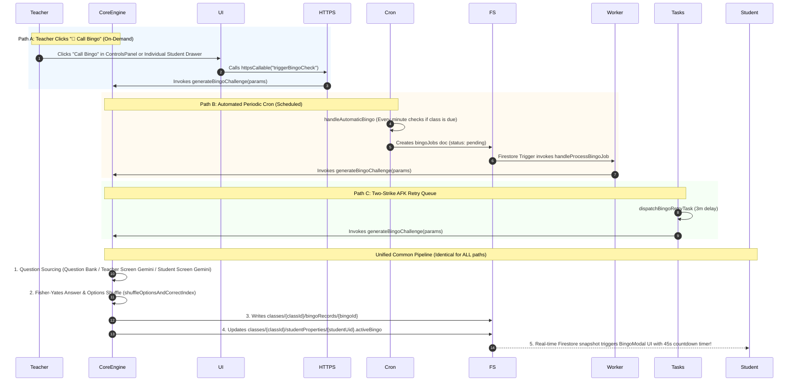
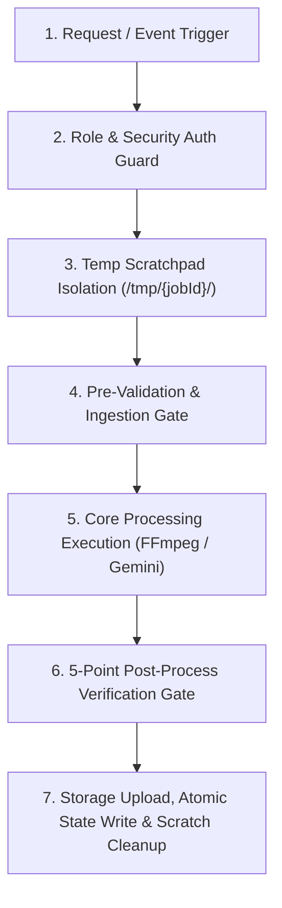

# Interactive Bingo Architecture & Media Batch Processing Pipeline Design

**System**: Google AI Classroom  
**Status**: Production Architecture & Design Reference  
**Last Updated**: October 2026  

---

## 1. Executive Summary

This document details the architectural rationale, trigger convergence, execution pipelines, and FinOps considerations for:
1. **Interactive Anti-Decoy Bingo Presence Verification**: Why on-demand teacher dispatch, automated periodic scheduling, and two-strike retry queues converge on a single backend pipeline, why the minimum dispatch interval is strictly 5 minutes, and how the 1-minute serverless cron operates within the free tier.
2. **Unified Media Processing & AI Batch Pipelines**: The standardized 7-point design pattern shared across teacher lecture video merges, student audio session merges, student screencast compilations, and asynchronous AI rubric evaluations.
3. **Scheduled Cloud Functions Audit**: Full catalog of all active cron schedules across the system demonstrating zero duplicate schedules.

---

## 2. Interactive Bingo Architecture: Unified Challenge Engine

### 2.1 Single Source of Truth (`generateBingoChallenge`)

A common question is whether clicking **"🎯 Call Bingo"** as a teacher uses a different code path or algorithm compared to the background automated scheduler. 

**They use the exact same backend pipeline.** Regardless of how a Bingo check is triggered, all execution paths converge on [`generateBingoChallenge()`](file:///home/developer/Documents/Gemini-AI-Classroom-Assistant/functions/ai_flows/bingoFlows.js).



---

### 2.2 Comparative Trigger Path Matrix

| Pipeline Dimension | 🖱️ Path A: On-Demand (Teacher Button) | ⏱️ Path B: Automated (Background Cron) | 🔄 Path C: Two-Strike Retry (Cloud Tasks) |
| :--- | :--- | :--- | :--- |
| **Origin Trigger** | Teacher clicks button in [`ControlsPanel.jsx`](file:///home/developer/Documents/Gemini-AI-Classroom-Assistant/web-app/src/components/monitor/ControlsPanel.jsx) or [`IndividualStudentView.jsx`](file:///home/developer/Documents/Gemini-AI-Classroom-Assistant/web-app/src/components/IndividualStudentView.jsx) | Serverless Cron `handleAutomaticBingo` in [`scheduledTasks.js`](file:///home/developer/Documents/Gemini-AI-Classroom-Assistant/functions/scheduled_tasks/scheduledTasks.js) | Cloud Task `dispatchBingoRetryTask` in [`bingoFlows.js`](file:///home/developer/Documents/Gemini-AI-Classroom-Assistant/functions/ai_flows/bingoFlows.js) |
| **Trigger Type** | `teacher_manual_all` or `teacher_manual_single` | `automated_periodic` | `scheduled_strike_retry` |
| **Target Function** | [`generateBingoChallenge()`](file:///home/developer/Documents/Gemini-AI-Classroom-Assistant/functions/ai_flows/bingoFlows.js) | [`generateBingoChallenge()`](file:///home/developer/Documents/Gemini-AI-Classroom-Assistant/functions/ai_flows/bingoFlows.js) | [`generateBingoChallenge()`](file:///home/developer/Documents/Gemini-AI-Classroom-Assistant/functions/ai_flows/bingoFlows.js) |
| **Question Sourcing** | Active class mode (`question_bank`, `teacher_screen`, or `student_screen`) | Active class mode (`autoBingoMode`) | Inherited from missed round |
| **Positional Bias Defense** | Fisher-Yates random shuffle (`shuffleOptionsAndCorrectIndex`) | Fisher-Yates random shuffle (`shuffleOptionsAndCorrectIndex`) | Fisher-Yates random shuffle (`shuffleOptionsAndCorrectIndex`) |
| **Firestore Output** | `classes/{classId}/bingoRecords/{bingoId}` | `classes/{classId}/bingoRecords/{bingoId}` | `classes/{classId}/bingoRecords/{bingoId}` |
| **Student UI Delivery** | Snapshot listener updates `studentProperties.activeBingo` $\to$ opens `BingoModal.jsx` | Snapshot listener updates `studentProperties.activeBingo` $\to$ opens `BingoModal.jsx` | Snapshot listener updates `studentProperties.activeBingo` $\to$ opens `BingoModal.jsx` |
| **Evaluation Engine** | Evaluated via [`submitBingoResponse()`](file:///home/developer/Documents/Gemini-AI-Classroom-Assistant/functions/ai_flows/bingoFlows.js) | Evaluated via [`submitBingoResponse()`](file:///home/developer/Documents/Gemini-AI-Classroom-Assistant/functions/ai_flows/bingoFlows.js) | Evaluated via [`submitBingoResponse()`](file:///home/developer/Documents/Gemini-AI-Classroom-Assistant/functions/ai_flows/bingoFlows.js) |

---

### 2.3 Why 5 Minutes is Strictly Enforced as the Minimum Interval

Both the frontend sliders (`min={5}`) and the backend scheduler (`Math.max(5, interval)`) enforce a strict **5-minute minimum interval**. The design rationale comprises four foundational requirements:

1. **Classroom Pedagogy & Anti-Fatigue**:
   - A Bingo challenge takes 45–60 seconds of intense focus with audio chimes and modal focus locks.
   - Firing challenges more frequently than every 5 minutes disrupts legitimate lecture listening, note-taking, and active coding exercises.
2. **Two-Strike Grace Period Alignment**:
   - When a student is AFK or misses a challenge (Strike 1), the system schedules a follow-up retry in **1 to 3 minutes** via Google Cloud Tasks.
   - A 5-minute primary interval guarantees that the grace-period retry completes before the next scheduled class-wide round triggers, avoiding overlapping modal collisions.
3. **FinOps & Gemini Multimodal Token Budgeting**:
   - In `teacher_screen` or `student_screen` modes, Gemini analyzes screen imagery to synthesize contextual questions.
   - Enforcing a 5-minute ceiling bounds AI cost to under $\approx \$0.0015$ per class hour, eliminating runaway API consumption.
4. **Network & WebRTC Bandwidth Relief**:
   - Staggered and class-wide challenges create sudden micro-bursts of WebSocket/Firestore signaling. A 5-minute spacing allows all student responses and leaderboard calculations to settle cleanly.

---

### 2.4 Serverless Cron Resolution (`* * * * *`) & FinOps Audit

The `handleAutomaticBingo` Cloud Function is configured with `schedule: '* * * * *'` (executes once every minute).

#### Why 1-Minute Polling Resolution is Used:
- **Arbitrary Lesson Start Times**: When an instructor clicks "Start Class" at `10:07 AM` with a 5-minute interval, the 1-minute cron triggers bingo at exactly `10:12 AM` (zero lag).
- **Custom Teacher Intervals**: Instructors can set any interval between 5 and 30 minutes (e.g., 6m, 7m, 11m, 15m). A 1-minute cron evaluates `(now - lastAutoBingoAt) >= intervalMs` with exact minute precision.
- **Microsecond Idle Exit**: When no classes are capturing or `autoBingoEnabled` is false, the function executes a single indexed Firestore query and exits in **~50 ms**.

#### Free Tier & Cost Breakdown:
| Resource | Volume per Month | Free Tier Allowance | Monthly Cost |
| :--- | :--- | :--- | :--- |
| **Cloud Run Invocations** | 1,440 / day $\approx$ 43,200 / month | 2,000,000 / month | **$0.00** |
| **Cloud Scheduler Jobs** | 1 job | 3 free jobs / account | **$0.00** |
| **Firestore Query Reads (Idle)** | 1 query / min (0 doc reads when idle) | 50,000 doc reads / day | **$0.00** |

---

## 3. Unified Media Processing & AI Batch Architecture

All backend media processing, audio/video concatenation, and AI batch operations follow the **Unified 7-Point Architectural Pattern**:



### 3.1 Comparative Architectural Matrix

| Pipeline Dimension | 🎥 Teacher Lecture Video Merge ([`mergeLectureRecordings.js`](file:///home/developer/Documents/Gemini-AI-Classroom-Assistant/functions/media_processing/mergeLectureRecordings.js)) | 🎙️ Student Session Audio Merge ([`mergeStudentSessionAudio.js`](file:///home/developer/Documents/Gemini-AI-Classroom-Assistant/functions/media_processing/mergeStudentSessionAudio.js)) | 🎬 Student Screencast Compilation ([`processVideoJob.js`](file:///home/developer/Documents/Gemini-AI-Classroom-Assistant/functions/media_processing/processVideoJob.js)) | 🤖 AI Video Analysis Batch Jobs ([`videoAnalysisBatchJob.js`](file:///home/developer/Documents/Gemini-AI-Classroom-Assistant/functions/ai_flows/videoAnalysisBatchJob.js)) |
| :--- | :--- | :--- | :--- | :--- |
| **Trigger Mechanism** | Callable HTTPS on demand + automated post-class cron | Callable HTTPS on demand (`mergeStudentSessionAudio`) | Firestore document trigger (`onDocumentCreated`) | Callable HTTPS + Google Cloud Tasks push queue |
| **Security & Auth Guard** | Role check: Instructor / Admin | Role check: Instructor / Admin or Student self-access | Internal Firestore pipeline | Role check: Authorized Instructor |
| **Temp Isolation** | `/tmp/merge_lecture_{id}/` | `/tmp/merge_student_audio_{jobId}/` | `/tmp/{jobId}/` | Cloud Task worker sandbox |
| **Core Processing Engine** | FFmpeg concat demuxer (Fast Copy $\to$ Re-encode fallback) | FFmpeg concat demuxer (AAC 128k, `.m4a`) | Sharp image batch resize $\to$ FFmpeg MP4 framerate assembler | Gemini 3.8 Flash / 3.5 Flash-Lite multimodal reasoning |
| **Fail-Safe / Zero Data Loss** | Raw clips preserved on failure; only verified outputs committed | Raw `.webm` chunks kept; output created independently | Raw screenshots retained unless auto-purge is enabled | Partial failure tracking with 1-click in-place retry |
| **Anti-Cheating / Exam Shield** | Exam recordings excluded from student view | Exam periods strictly filtered out | Flagged proctoring violations strictly exempt from deletion | Evaluates compliance timestamps without leaking test questions |
| **Storage Lifecycle** | Atomic cleanup of raw temp files; output linked in Firestore | Temp files purged in `finally` block; Firestore document recorded | Purges routine frames only if `purgeScreenshotsAfterVideoCombine` is true | Tracks token consumption & cost analytics in Firestore |

---

## 4. Audit of Scheduled Cloud Functions

The system maintains **4 distinct, centralized scheduled functions** with **zero duplicates**:

```text
functions/scheduled_tasks/scheduledTasks.js
├── 1. handleAutomaticCapture              (Cron: '5,25,35,55 * * * *')  [30m Slot Scheduler]
├── 2. handlePostLessonMediaConsolidation  (Cron: '15,45 * * * *')       [Post-Class Student & Teacher Media Consolidator (alias: handleAutomaticVideoCombination)]
├── 3. handleAutomaticBingo                (Cron: '* * * * *')           [Periodic Presence Check]
└── 4. syncGeminiPricing                   (Cron: 'every 24 hours')      [Vertex AI Billing Sync]
```

1. **`handleAutomaticCapture`** (`5,25,35,55 * * * *`):
   - Evaluates active class timetables 5 minutes before scheduled start and 5 minutes after scheduled end.
   - Automatically sets `isCapturing: true` or `isCapturing: false` so students and teachers don't need manual activation.
2. **`handlePostLessonMediaConsolidation`** (`15,45 * * * *`) *(legacy alias: `handleAutomaticVideoCombination`)*:
   - Offsets by 15 minutes after lesson slots end to allow lingering student uploads to complete.
   - Assembles student screencasts into MP4 videos and triggers teacher lecture video concatenation.
3. **`handleAutomaticBingo`** (`* * * * *`):
   - Runs every minute to evaluate if any actively capturing class with `autoBingoEnabled: true` has reached its configured interval.
   - Dispatches pending Bingo jobs without human intervention.
4. **`syncGeminiPricing`** (`every 24 hours`):
   - Queries Google Cloud Billing Catalog API daily to update token input/output costs and Cloud Storage GiB/month rates in `system_config/pricing`.

---

## 5. Summary & Key Takeaways

1. **Zero Divergence**: There is no "different path" between manual Bingo and automated Bingo. Every challenge originates through the identical `generateBingoChallenge` engine, ensuring identical question formatting, shuffle entropy, timer rules, and result recording.
2. **Pedagogical Safety**: The 5-minute minimum interval protects students from distraction, aligns with the Two-Strike retry queue, and bounds AI FinOps costs.
3. **Architectural Symmetry**: Audio merging, video merging, screencast compilation, and AI evaluations adhere to the same isolated scratchpad and 5-point verification patterns, guaranteeing zero data loss across the platform.
