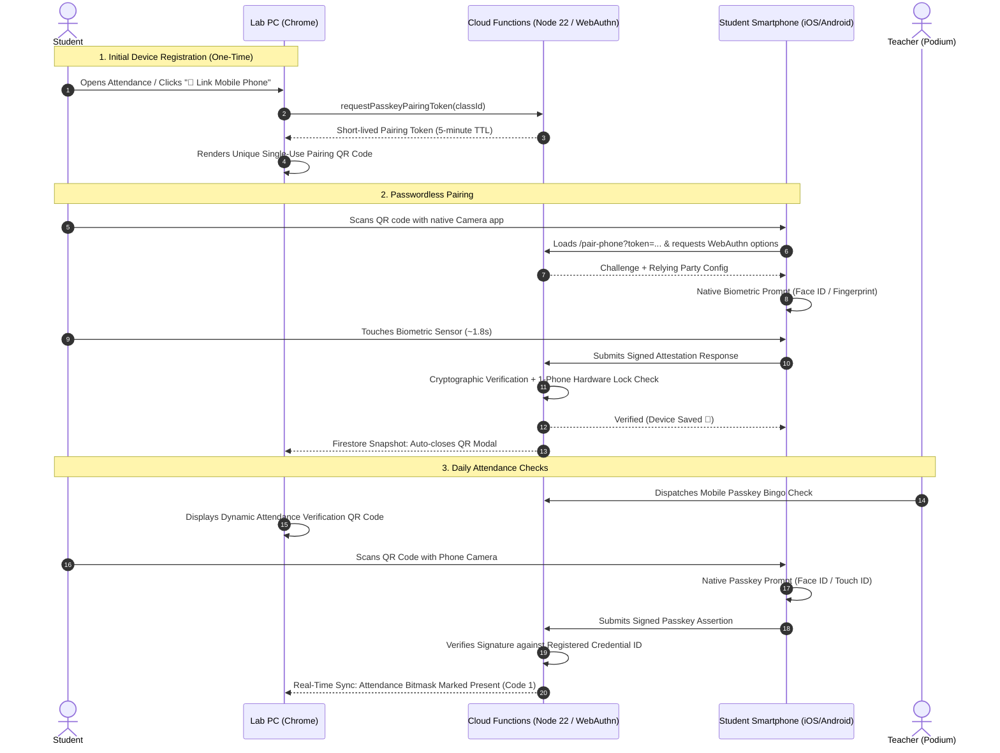
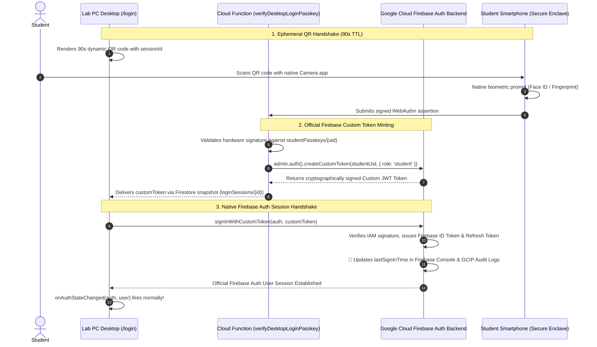
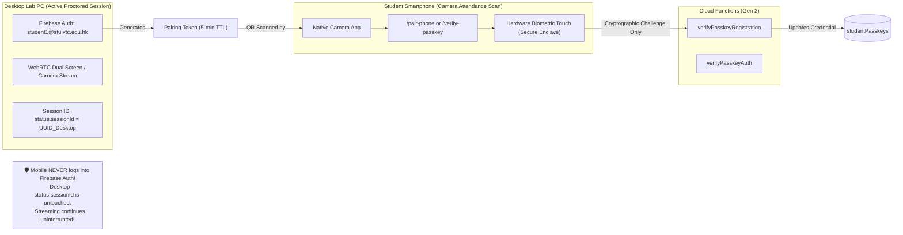

# 📱 Mobile Passkey Device Registration & Attendance Guide

[🏠 Documentation Index](../README.md#documentation-index) | [🧑‍🎓 Student User Manual](./user-manual-student.md) | [👨‍🏫 Teacher User Manual](./user-manual-teacher.md) | [🏛️ System Architecture](./system-architecture.md)

---

## 🎯 Executive Overview

In academic computer labs without webcams or hardware biometric readers on desktop PCs, students often share login credentials or remotely log into each other's accounts. 

To eliminate proxy attendance without requiring expensive lab hardware upgrades or invasive software installs, the **Google AI Classroom Platform** incorporates **Mobile Passkey Biometric Verification (FIDO2 / WebAuthn)**.

### Key Architectural Guarantees:
- **Zero Passwords on Mobile**: Students never type emails or passwords on their smartphones. Pairing is authorized via an encrypted, single-use token on their already-authenticated lab PC.
- **1-Phone = 1-Student Hardware Lock**: The platform authenticator's public credential ID is bound directly to the student's UID. The server cryptographically rejects attempts to register the same physical smartphone to multiple student accounts (with controlled multi-role exemptions for faculty/testing).
- **Fast Attendance (< 2 Seconds)**: Routine in-class attendance requires only pointing the phone camera at the PC screen and touching the biometric sensor (Face ID, Touch ID, or Android Fingerprint).
- **Teacher Mobile Passkey Login**: Instructors can scan the desktop login QR code on shared lab PCs to log in with zero keyboard password entry, avoiding keylogger risks while retaining 100% password login capability.
- **Strict Anti-Proxy Device Locking & Instructor Resets**: Regular students cannot self-unlink or rotate phones at will, ensuring that a present student cannot bounce phones between absent peers. When a student replaces their phone, their course instructor performs a 1-click reset via the Live Attendance Podium or Class Management Roster. Instructors and whitelisted testing accounts retain self-unlinking capabilities.

---

## 🔄 End-to-End Visual Sequence



---

## 🧑‍🎓 Student Walkthrough: Registration, QR Login & Attendance

### Step 1: Enforced First-Time Registration Gate (Mandatory Lab Onboarding)

When a student logs in to a computer lab desktop for the first time without having linked a smartphone:

1. **Mandatory Desktop Gate (`PasskeyEnforcementGate`)**:
   - The desktop workspace immediately locks navigation to `/student`, `/student/records`, and screen/webcam streaming.
   - The desktop displays an anti-desktop security advisory:
     > ⚠️ **Shared Lab PC Detected — Desktop Passkeys Prohibited**  
     > *To guarantee your identity and prevent account duplication, passkeys must reside exclusively in your personal smartphone's hardware Secure Enclave (Apple Face ID or Android Fingerprint). Do NOT register Windows Hello or local PINs on this shared PC.*
   - A single-use 256x256 pairing QR code is generated (`/pair-phone?token=<tokenId>`).

2. **On your Smartphone:**
   - Open your smartphone's built-in **Camera app** (iOS Safari or Android Chrome).
   - Point your camera at the QR code on your PC monitor and tap the link notification.
   - Tap **`[ 📱 Pair This Phone ]`** and confirm with **Face ID** or **Fingerprint**.

3. **1-Phone = 1-Student Hardware Binding**:
   - The server extracts the public `credentialID` and verifies it is not bound to another student account (`DUPLICATE_DEVICE_COLLISION` check).
   - Once stored in `studentPasskeys/{uid}`, the desktop monitor detects the registration via Firestore snapshot and automatically dismisses the gate: *"🎉 Phone Paired! Entering classroom..."*

---

### Step 2: Desktop Login via Mobile Scan QR Code (Passwordless Cross-Device Auth)

For daily lab sessions, students can sign into shared desktop PCs without typing passwords on public keyboards:

1. **Select QR Login on Desktop**:
   - On the desktop login screen (`/login`), click **`📱 Scan QR Code`**.
   - An ephemeral 90-second dynamic QR code is displayed with live countdown.
2. **Scan with Phone Camera**:
   - Point your phone camera at the desktop monitor.
   - Tap the banner to open `/mobile-login?session=<sessionId>`.
3. **Biometric Authorization**:
   - Tap **`[ 📱 Sign In with Biometrics ]`** (or let auto-prompt trigger Face ID / Fingerprint).
   - Cloud Function `verifyDesktopLoginPasskey` validates the assertion and mints a Firebase Custom Auth Token for the desktop session.
4. **Desktop Auto-Login**:
   - The desktop PC detects `status: 'authorized'` in Firestore, calls `signInWithCustomToken(auth, customToken)`, and logs into the workspace without any keyboard entry.

---

### 🔄 Architectural Deep Dive: Native Firebase Auth Integration via Custom Tokens

A common architectural question is: **"In the past, Firebase Auth was built-in (email/password). Since the QR code flow is our own custom UI, how does it match Firebase Auth logs, sessions, and security rules?"**

The answer is that the QR code flow does **not** bypass or replace Firebase Auth. Instead, it utilizes Google's official **Firebase Auth Custom Token Minting** mechanism (`createCustomToken` on the backend and `signInWithCustomToken` on the client SDK).

#### End-to-End Authentication Bridge:



#### Dual-Mode Comparison: Built-In Email/Password vs. QR Code Passkey Flow

| Capability / Metric | Built-in Email/Password (Past) | QR Code Passkey Flow (New) |
| :--- | :--- | :--- |
| **Client Sign-In API** | `signInWithEmailAndPassword(auth, email, pass)` | `signInWithCustomToken(auth, customToken)` *(Standard Firebase SDK)* |
| **Firebase Auth Console** | Updates user's `lastSignInTime` | Automatically updates user's `lastSignInTime` identically |
| **`onAuthStateChanged()`** | Triggers reactive UI state | Triggers reactive UI state identically on desktop |
| **Firestore Security Rules** | Verified via `request.auth.uid` | Verified via `request.auth.uid` identically |
| **Custom Claims (`role`)** | Injected in JWT token | Injected directly via `createCustomToken(uid, { role: 'student' })` |
| **GCIP / Cloud Audit Logs** | Records `signInWithPassword` | Records `createCustomToken` and `signInWithCustomToken` events |
| **Dedicated Security Audit** | None | **`passkeyAuditLogs`** logs smartphone model, session ID, counter, and timestamp |
| **Shared Lab PC Keystrokes** | ❌ Vulnerable to hardware/software keyloggers & shoulder surfing | ✅ **Zero keystrokes on lab PC keyboard** |

#### Complete Student Device Lifecycle:

1. **Desktop Lab PC (Zero Passwords):**
   - Students **never** need to type their email or password on shared lab PC keyboards.
   - The desktop displays an ephemeral QR code that unlocks via phone biometric scan.
2. **First-Time Setup on Mobile Phone:**
   - The student logs in on their personal smartphone using their institutional **Email & Password**.
   - After signing in, they tap **`[ 📱 Enable Mobile Passkey ]`**.
   - Their phone's hardware security chip (Apple Secure Enclave / Android Keystore) generates a FIDO2 key pair linked to their UID.
3. **Subsequent Mobile Logins:**
   - Future logins on the smartphone use the biometric passkey (instant Face ID or Fingerprint), eliminating password entry on mobile as well.
4. **Enforcement Behavior If Passkey Is NOT Enabled:**
   - **On Mobile:** The student **can still log in with Email & Password** on their personal smartphone. This ensures they are never locked out of their personal device and can proceed to enable their passkey.
   - **On Desktop:** Desktop access is **strictly blocked**:
     - Scanning the desktop QR code halts with: *"No passkey registered on this device yet."*
     - Typing email/password on desktop triggers [`PasskeyEnforcementGate`](file:///home/developer/Documents/Gemini-AI-Classroom-Assistant/web-app/src/components/passkey/PasskeyEnforcementGate.jsx), locking navigation, streaming, and attendance.
     - The only desktop bypasses are:
       1. **Teacher Manual Failsafe** (Podium 1-click or Emergency PIN).
       2. **Global Password Whitelist (`system_config/loginPolicy`)**: Admins and test accounts placed in the `passwordWhitelist` array are permitted to sign in on Desktop with their institutional email/password without passkey barrier blocking.

---

### Step 3: Daily Lab Attendance Verification (< 2 Seconds)

Once your phone is paired, taking attendance during lectures or labs is fast and effortless:

1. **Teacher Launches Attendance Check:**
   - A dynamic attendance QR code appears on your Lab PC monitor.
2. **Scan with Phone:**
   - Point your phone camera at the PC screen.
3. **Biometric Confirmation:**
   - Your phone immediately triggers Face ID / Fingerprint prompt.
4. **Attendance Recorded:**
   - Mobile displays: **"✅ Attendance Verified!"**
   - Lab PC display updates to **"📱 Passkey Verified!"** with a green checkmark.

---

## 👨‍🏫 Teacher Administration & Edge-Case Management

In computer lab environments, edge cases such as dead phone batteries, forgotten phones, cracked camera lenses, or device replacements will occur. The platform provides a multi-tier teacher failsafe architecture:

### 1. Remote 1-Click Approval on Teacher Podium HUD (`MonitorView`)

When a student arrives at a lab PC without a usable smartphone:

```
  Desktop Lab PC (Student)                    Teacher Podium HUD (MonitorView)
┌────────────────────────────┐              ┌─────────────────────────────────────────────────────────┐
│ Passkey Enforcement Gate   │              │ ⚠️ Passkey Remote Bypass Requests (1 Pending)           │
│ [🙋 Request Teacher Bypass]│──Firestore──►│ • Chan Tai Man (student1@stu.vtc.edu.hk)                │
│ "Phone battery dead"       │              │   Reason: Phone battery depleted (14:02)                │
│                            │              │   [ ✅ Grant 1-Class Session Bypass ]   [ ❌ Deny ]     │
└────────────────────────────┘              └─────────────────────────────────────────────────────────┘
              ▲                                                           │
              │                                                Cloud Function onCall
              │                                            handleApproveTeacherPasskeyBypass
              │                                                           │
              └────────────── Firestore Real-Time Unlock ─────────────────┘
                         (studentProperties/{uid}.passkeyBypass)
```

1. **Student Request**: The student clicks **`🙋 Request Teacher Remote Bypass`** on the desktop gate, selects a reason (e.g., "Phone battery dead" or "Left phone at home"), and submits.
2. **Instant Podium Notification**: A high-visibility alert banner appears in real time on the teacher's `MonitorView` HUD showing the student's name, email, and timestamp.
3. **1-Click Authorization**: The teacher glances across the lab to verify the student's identity and clicks **`[ ✅ Grant 1-Class Session Bypass ]`**.
4. **Cloud Execution**: `handleApproveTeacherPasskeyBypass` grants a 180-minute bypass window in `studentProperties/{studentUid}.passkeyBypass` and writes an immutable audit entry to `passkeyAuditLogs`.
5. **Zero-Latency Gate Unlock**: The desktop PC detects the bypass flag via Firestore listener and transitions straight into the classroom workspace without requiring any page reload.

---

### 2. In-Person 6-Digit Class Emergency PIN Bypass

If the teacher's podium browser is temporarily busy or network connectivity between the podium and the student is delayed:

1. **Emergency PIN Display**: The teacher HUD displays a generated 6-digit emergency PIN for the class session (e.g., `🔑 Emergency Bypass PIN: 849201`).
2. **Student Entry**: On the desktop gate modal, the student selects **`🔑 Enter Emergency Teacher PIN`** and inputs the 6-digit PIN.
3. **Server Verification**: Cloud Function `handleVerifyTeacherPasskeyBypassPin` validates the PIN against `classes/{classId}.teacherBypassPin`.
4. **Temporary Access**: Upon validation, a 180-minute bypass is provisioned, the gate unlocks immediately, and an audit log records the PIN bypass event.

---

### 3. In-Person Attendance Bingo Override (Live Attendance Failsafe)

During interactive Mobile Passkey Bingo Attendance:

1. **Student Action:** If a student cannot scan the attendance QR, they click **`🙋 I don't have my phone today`** on their Lab PC screen.
2. **Podium Alert:** The teacher's live monitor instantly surfaces an alert banner showing the student's name, seat, and timestamp.
3. **Verification:** The student approaches the teacher's podium. The teacher confirms physical presence and clicks **`[ ✅ Verify In-Person ]`**.
4. **Result:** The student's attendance bitmask is marked present with verification type `in_person_teacher_override`.

---

### 4. Replacing or Upgrading a Smartphone (Passkey Reset)

Because each student account is locked 1-to-1 to a physical device hardware authenticator, a student who buys a new phone or gets a replacement cannot simply pair a second phone without resetting the previous registration.

#### Method A: Reset from Live Attendance / Podium View
1. When the student approaches the podium, the teacher locates the student in the **Active Attendance Table**.
2. Click the **`[ 🔄 Reset Passkey ]`** button in the *Podium Actions* column.
3. Confirm the modal: *"Reset passkey registration for student1@stu.vtc.edu.hk? This will unlink their existing smartphone."*
4. The previous credential ID is unlinked, and an entry is written to `passkeyAuditLogs`.
5. The student can immediately scan the pairing QR code with their new phone.

#### Method B: Reset from Class Management Roster
1. Navigate to **`👥 Class Management`** ➔ Select the class.
2. Under the **Enrolled Students Roster**, locate the student.
3. In the **Phone Passkey** column:
   - If paired: Displays `📱 Apple iPhone` (or Android model) with a **`[ 🔄 Reset ]`** button.
   - If unlinked: Displays `⚪ Not Paired`.
4. Click **`[ 🔄 Reset ]`** and confirm.

#### Method C: Device Unlinking Policy & Self-Service for Instructors / Testers
1. **Regular Students (Anti-Proxy Enforcement)**:
   - Regular students **cannot** self-unlink or switch paired smartphones on demand. Allowing students to arbitrarily unlink and re-pair phones would create attendance proxy vulnerabilities (e.g., swapping phones to clock in absent peers).
   - In `PasskeyPairModal`, students with an existing paired phone see:
     > ℹ️ **Need to replace or switch your phone?** Please ask your course instructor to reset your passkey registration.
   - The backend Cloud Function `resetStudentPasskey` rejects unauthorized student self-reset requests with `permission-denied`.
   - Students who replace or lose their phone must ask their course instructor to perform a reset via **Method A (Live Podium)** or **Method B (Class Management Roster)**.
2. **Teachers & Whitelisted Accounts**:
   - Instructors and whitelisted dual-role testing accounts (`PASSKEY_DEVICE_SHARING_WHITELIST`, e.g. `cywong@vtc.edu.hk`, `t-cywong@stu.vtc.edu.hk`) can self-service unlink:
     1. Open **Account Menu** ➔ **`📱 Passkey Phone ([Device Model])`**.
     2. Click **`[ 🔄 Unlink / Switch Phone ]`** and confirm.
     3. The server clears the credential and renders a fresh pairing QR code.

---

### 5. Teacher Mobile Passkey Login on Shared Lab PCs & Podium Workstations

Instructors routinely rotate between classroom lab PCs, lecture hall podiums, and shared computers. Typing institutional passwords on shared hardware introduces significant risks of shoulder surfing, hardware keyloggers, or leftover browser sessions.

To address this, instructors can use the exact same mobile passkey QR architecture to sign into desktop workstations:

1. **One-Time Smartphone Pairing via Account Settings**:
   - In the global header, click your account badge in the upper right to open the **Account Menu**.
   - Click **`📱 Pair Phone (Passkey)`** to open the pairing modal.
   - Scan the pairing QR code with your smartphone camera and confirm biometrics (Face ID, Touch ID, or Android Fingerprint).
   - Once paired, your linked model displays as **`📱 Passkey Phone: Apple iPhone`** (or Android Device) in your Account Menu. (This is purposefully housed inside Account Settings to keep the dashboard hero toolbar clean and distraction-free).
2. **Passwordless Lab PC Login**:
   - On the shared lab PC login screen (`/login`), click **`📱 Scan QR Code`**.
   - Point your personal smartphone camera at the 90-second rotating QR code.
   - Tap the prompt and authenticate with your phone biometrics.
   - Cloud Function `handleVerifyDesktopLoginPasskey` inspects the passkey document and caller role:
     - Automatically derives `role: 'teacher'`.
     - Mints an official Firebase Custom Auth Token with `{ role: 'teacher' }` via `admin.auth().createCustomToken(uid, { role: 'teacher' })`.
     - Records an immutable audit log `TEACHER_DESKTOP_LOGIN_VIA_MOBILE_QR` in `passkeyAuditLogs`.
   - The lab PC instantly signs in and loads the **Teacher Command Center** with zero keyboard interaction.
3. **100% Password Fallback**:
   - Unlike desktop students (who are barred by `PasskeyEnforcementGate` until a phone is paired), instructors are **always permitted to use institutional email and password** on any device. Mobile passkey login is completely optional for instructors.

---

### 6. Multi-Role Testing & Whitelisted Device Sharing

A critical requirement in educational engineering is that instructors and IT administrators must test the student experience using secondary testing accounts (e.g. `t-cywong@stu.vtc.edu.hk`) while managing live classes with their faculty account (`cywong@vtc.edu.hk`) using their **single physical smartphone**.

#### The Hardware Lock Collision Problem:
Normally, the platform enforces a strict **1-Phone = 1-Student Hardware Lock** via `deviceFingerprint` (`mdev_<uuid>`) to prevent students from sharing one phone to proxy-attendance for absent peers. If an instructor paired their phone to their student test account, subsequent attempts to register their teacher account on that same phone would be rejected with:
> `already-exists`: *Hardware Lock: This physical phone is already bound to student account...*

#### The Multi-Role Whitelist Exemption:
The backend introduces a cryptographic whitelist exemption in [`functions/config.js`](functions/config.js) and [`switch-env.sh`](switch-env.sh):
```javascript
export const PASSKEY_DEVICE_SHARING_WHITELIST = (process.env.PASSKEY_DEVICE_SHARING_WHITELIST || 'cywong@vtc.edu.hk,t-cywong@stu.vtc.edu.hk')
  .split(',')
  .map(d => d.trim().toLowerCase())
  .filter(Boolean);

export function isPasskeySharingWhitelisted(email) {
  if (!email || typeof email !== 'string') return false;
  return PASSKEY_DEVICE_SHARING_WHITELIST.includes(email.trim().toLowerCase());
}
```

In `handleVerifyPasskeyRegistration`:
- The server checks whether either the incoming registrant or the existing device owner is a **teacher** (`userRole === 'teacher'`) or a **whitelisted account** (`isPasskeySharingWhitelisted(email)`).
- If either account is a teacher or whitelisted, the hardware collision lock is exempted, and multi-role pairing is permitted:
  - WebAuthn generates an independent public key pair and unique `credentialID` for each account on the phone.
  - When scanning the Desktop QR on a shared lab PC, the phone's native OS displays an account selector (e.g. `cywong@vtc.edu.hk` vs `t-cywong@stu.vtc.edu.hk`). Selecting the desired account logs the lab PC into that specific role.
- **Student Anti-Proxy Integrity**: For standard student-to-student collisions (`student1` and `student2`), neither account is whitelisted or a teacher, so the 1-phone = 1-student hardware lock remains **100% strictly enforced**.

---

## 💻 Desktop & Tablet Registration Block Policy (Smartphones Only)

A core architectural principle of the Mobile Passkey subsystem is that **shared desktop computers and tablets (iPads, Android pads) must never be registered as passkey hardware authenticators**. They operate as desktop classroom terminals and must log in via password or by scanning desktop QR codes with a personal smartphone.

### Why Desktop & Tablet Registration is Blocked:
1. **Shared Public & Lab Hardware**: Lab PCs and institutional tablets are frequently shared across multiple student cohorts. Registering a tablet's browser or TPM would anchor attendance to the classroom device rather than the student's personal physical possession.
2. **Deep Freeze & Nightly Re-imaging Disruption**: Institutional computer labs and managed tablet carts run profile wipes and MDM resets upon reboot. Any device-stored credentials would vanish, causing repeated authentication lockouts.
3. **Hardware Anti-Proxy Guarantee**: Enforcing handheld smartphone-only registration (`isHandheldPhone()`) guarantees that cryptographic credential IDs reside strictly inside the student's personal smartphone hardware security module (Apple Secure Enclave or Android Titan/StrongBox).
4. **Desktop Login Parity for Tablets**: iPads and Android tablets access the full desktop login interface (Email & Password or desktop QR session code to be scanned by a handheld phone).

### UI Enforcement:
- **Direct Route Access**: If a student accesses `/pair-phone`, `/verify-passkey`, `/verify-lecture-passkey`, or `/mobile-login` on a desktop or tablet browser (iPadOS Safari, Android Tablet Chrome, Windows, macOS, or Linux), `isHandheldPhone()` detects the non-smartphone environment and renders the **`🚫 Mobile Phone Required`** barrier:
  > *"Mobile Passkeys must be registered on your personal handheld smartphone (iOS or Android) to enable biometric attendance. Shared desktop computers and tablets/iPads cannot be registered as mobile passkeys. Please scan the QR code displayed on your screen using your smartphone camera."*
- **Desktop/Tablet Modal (`PasskeyPairModal.jsx`) & Gate (`PasskeyEnforcementGate.jsx`)**: When viewed on a desktop or tablet viewport, the interface strictly renders the **Pairing QR Code** for mobile camera scanning. Direct passkey registration is suppressed.
- **Login Tab Navigation (`AuthComponent.jsx`)**: Tablets default to the desktop login interface with Scan QR Code and Email/Password tabs.

### 📱 Flip Phones, Foldables & Comprehensive Device Matrix

The platform deterministically distinguishes handheld smartphones (including modern flip phones and foldables) from tablets and desktops:

1. **Clamshell Flip Smartphones (Samsung Galaxy Z Flip, Motorola Razr)**:
   - **User-Agent**: Transmits standard `Android` + `Mobile` tokens.
   - **Screen Dimensions**: Viewport width when unfolded is ~360–412 CSS px, matching standard smartphone geometry.
   - **Biometrics**: Full WebAuthn support via side-mounted capacitive fingerprint sensor and Android Keystore (StrongBox/Titan).
   - **Result**: `isHandheldPhone()` = `true` (✅ **100% Fully Supported**).

2. **Book-Style Foldable Smartphones (Samsung Galaxy Z Fold, Google Pixel Fold, OnePlus Open)**:
   - **Folded (Cover Screen)**: Operates as a slim phone (width ~380–400 CSS px, `Android` + `Mobile`).
   - **Unfolded (Main Screen)**: Unfolds to a square ~700–800 CSS px inner display. Because the browser User-Agent contains the `Mobile` token, `isTabletDevice()` explicitly excludes it from tablet classification, ensuring it is recognized as a personal smartphone in both folded and unfolded states.
   - **Result**: `isHandheldPhone()` = `true` (✅ **100% Fully Supported**).

3. **Legacy / Feature Flip Phones (Nokia 2720 Flip, KaiOS / Non-Smart Dumb Phones)**:
   - Feature phones lack the W3C WebAuthn API (`PublicKeyCredential`) and hardware biometric sensors.
   - Gracefully detected by `browserSupportsWebAuthn() === false`, prompting the student to use their smartphone or request a **Teacher Remote 1-Click Bypass** / **6-Digit Emergency PIN**.

#### Device Classification & Passkey Compatibility Matrix

| Device Type & Form Factor | Hardware / User-Agent Profile | `isHandheldPhone()` | Passkey Registration | In-Class Attendance Flow |
| :--- | :--- | :---: | :---: | :--- |
| **iPhone (all models)** | `iPhone` / `iOS Safari` / `CriOS` | ✅ `true` | ✅ **Allowed** | Native Face ID / Touch ID Biometric Touch |
| **Android Smartphone** | `Android` + `Mobile` token | ✅ `true` | ✅ **Allowed** | Under-Display / Side Fingerprint / Titan M2 |
| **Flip Smartphone (Galaxy Z Flip, Razr)** | `Android` + `Mobile` | ✅ `true` | ✅ **Allowed** | Side Fingerprint Sensor Touch |
| **Foldable (Galaxy Z Fold, Pixel Fold)** | `Android` + `Mobile` (Folded & Unfolded) | ✅ `true` | ✅ **Allowed** | Side Fingerprint / Power Button Biometrics |
| **iPad / iPad Mini / iPad Pro** | `iPad` or `Macintosh` + `maxTouchPoints > 1` | ❌ `false` | 🚫 **Blocked** | Desktop Login / Scans Desktop QR via Phone |
| **Android Tablet / Pad (Galaxy Tab)** | `Android` (without `Mobile` token) | ❌ `false` | 🚫 **Blocked** | Desktop Login / Scans Desktop QR via Phone |
| **Lab PC / Mac / Windows Laptop** | Windows / macOS / Linux Desktop | ❌ `false` | 🚫 **Blocked** | Desktop Login / Scans Desktop QR via Phone |
| **Legacy Feature Flip Phone (KaiOS)** | No WebAuthn `PublicKeyCredential` | N/A | 🚫 **Blocked** | Teacher Remote 1-Click Bypass or Emergency PIN |

---

## 🔒 Single-Session Integrity vs. Passwordless Mobile Passkey (No Dual Session Needed)

A common question when designing companion mobile flows is whether the system must support "Dual Sessions" (1 mobile session + 1 desktop session) and whether opening the phone will displace the student's active desktop stream.

### Architectural Guarantee: Zero Session Interference


### Why Dual Session Support is Unnecessary & Intentionally Avoided:
1. **Passwordless & Sessionless on Mobile**:
   - The mobile pairing and attendance pages **do not create an interactive Firebase Auth user session**.
   - Pairing is authorized solely through the short-lived, encrypted `pairingToken` issued by the student's already-authenticated Lab PC.
   - Attendance verification is authorized via the signed WebAuthn challenge payload.
   - Consequently, the student's mobile phone does not write to `classes/{classId}/students/{studentUid}/status.sessionId`.
2. **Preserving Strict Account Anti-Sharing (Single-Session Displacement)**:
   - The platform's single-session lock (`status.sessionId`) remains **100% active and uncompromised on desktop**.
   - If Student A gives their institutional password to Student B to log in on a second lab PC or from home, the second desktop login instantly displaces the first with the warning:
     > ⚠️ **Classroom session active in another tab or device.**  
     > *Streaming in this tab is paused to prevent dual-streaming conflicts.*
3. **Zero FinOps Overhead**:
   - Because mobile passkeys operate completely sessionless via lightweight Cloud Functions callables, there are no idle Firestore listener connections or duplicated WebRTC peer connections on mobile.

---

## 🛡️ Anti-Cheating & Security Analysis

### Passkey Exportability & Dual-Factor Hardware Binding Model

#### Can a Student Export a Passkey and Give It to Another Student?
Modern operating systems and password managers support passkey synchronization and export features:
* **Apple AirDrop & iCloud Shared Groups**: iOS and macOS allow users to securely share passkeys peer-to-peer with trusted contacts or family members via AirDrop.
* **Google Password Manager & Account Sync**: Passkeys automatically synchronize between devices signed into the same Google Account and support standardized credential export.
* **Third-Party Password Managers (Bitwarden, 1Password, Dashlane)**: Passkeys stored in third-party password vaults can be shared across shared vaults or exported via FIDO Alliance Credential Exchange (CXP) formats.

#### Platform Defense: Dual-Layer Device Binding
Even if a student exports, syncs, or AirDrops their WebAuthn passkey to a classmate's device, **proxy login and attendance check-in are completely blocked**.

The platform does not rely solely on the WebAuthn cryptographic assertion. Instead, it enforces a **Dual-Layer Binding Architecture**:
$$\text{Authentication Authorized} \iff \text{Valid WebAuthn Cryptographic Signature} \land \text{Matching Persistent Hardware Fingerprint } (\text{mdev\_}\langle\text{uuid}\rangle)$$

1. **Registration Binding**: During initial phone pairing via `/pair-phone`, the student's mobile browser generates a hardware-anchored device fingerprint `deviceFingerprint` (`mdev_<uuid>`) and commits it alongside the WebAuthn `credentialID` and `credentialPublicKey` to `studentPasskeys/{studentUid}` in Firestore.
2. **Hardware Lock Collision Query**: The Cloud Function [`handleVerifyPasskeyRegistration`](functions/ai_flows/passkeyFlows.js) executes `where('deviceFingerprint', '==', deviceFingerprint)`. If the physical phone is already paired with another student account, registration is immediately aborted with `already-exists` (`Hardware Lock Violation`).
3. **Verification Assertion Lock**: During any passkey authentication flow ([`handleVerifyLecturePasskeyAuth`](functions/ai_flows/passkeyFlows.js), [`handleVerifyPasskeyAuth`](functions/ai_flows/passkeyFlows.js), or [`handleVerifyDesktopLoginPasskey`](functions/ai_flows/passkeyFlows.js)), the incoming assertion must supply the browser's current `deviceFingerprint`. If a student imported a classmate's passkey onto their own device, the device fingerprint sent by their browser will not match the registered fingerprint in `studentPasskeys/{studentUid}`, and the server immediately throws `permission-denied` (`Device mismatch detected`).
4. **Fail-Closed Security Design**: If a student clears their browser cache or uses private browsing, a new fingerprint is generated that fails the mismatch check. The system fails closed (denying access), requiring the student to obtain an in-person passkey reset from the teacher.

---

### Comprehensive Anti-Cheating Matrix

| Threat / Cheating Vector | Vulnerability in Standard Systems | Platform Passkey Defense |
| :--- | :--- | :--- |
| **Passkey Sharing / AirDrop Delegation** | Student exports or AirDrops their passkey to an absent friend's phone to check in remotely. | **Blocked via Dual-Layer Binding**: Friend's phone transmits their own `deviceFingerprint`. Server detects `passkey.deviceFingerprint !== request.deviceFingerprint` and aborts with `Device mismatch detected`. |
| **Device Sharing (1 Phone for 2 Students)** | One present student brings their phone and attempts to register or proxy-login for absent friends. | **Blocked via Strict 1:1:1 Binding**: Mobile browser stores persistent `deviceFingerprint` (`mdev_<uuid>`). Server validates `where('deviceFingerprint', '==', deviceFingerprint)`. If the phone is already bound to Student A, Student B's attempt is aborted with `Hardware Lock Violation`. |
| **Password Sharing & Keyloggers on Lab PCs** | Students type passwords on public lab keyboards vulnerable to hardware/software keyloggers or shoulder surfing. | **Blocked**: Desktop QR Login (`/mobile-login`) allows complete passwordless authentication. Students authenticate solely on their personal mobile biometric sensor, minting an ephemeral custom token directly to the desktop session. |
| **Lab PC Passkey Pollution & Re-imaging Wipes** | Passkeys stored on Windows Hello / macOS Keychain pollute shared PCs and are wiped by nightly Deep Freeze re-imaging. | **Blocked**: Desktop WebAuthn is strictly barred (`isHandheldPhone()`). Authenticators reside exclusively in the student's mobile hardware security module (Secure Enclave / Android Keystore). |
| **Tablet / iPad Device Spoofing** | Students use iPads or Android tablets with physical keyboards as mobile proxies. | **Blocked**: Tablet detection rules (`isTabletDevice()`) force all tablets into desktop terminal mode, barring mobile passkey enrollment and requiring pairing from a handheld smartphone. |
| **Multiple PC Logins (Proxy Sitting)** | One student logs into multiple PCs in the lab. | **Blocked**: Desktop single-session displacement (`sessionId`) immediately boots older tabs when a new login occurs. |
| **Attempting to Register Lab PC as Passkey** | Student tries to register the shared PC browser to automate passkey prompts. | **Blocked**: `isHandheldPhone()` detects desktop environments on `/pair-phone` and halts execution with `status: 'desktop_blocked'`. |
| **QR Code Forwarding / Screenshots** | Absent student asks present friend to take a photo of the QR code and message it. | **Blocked**: QR codes encode single-use nonces and 15s rotating intervals with 90s TTL. Biometric assertion requires the physical device containing the student's private key. |
| **Teacher Bypass Abuse / Privilege Creep** | Unrestricted permanent bypasses granted for absent students. | **Blocked**: All teacher bypasses automatically expire after 180 minutes (current class duration). Every bypass decision (remote 1-click or PIN) writes an immutable record to `passkeyAuditLogs`. |
| **Simulated WebAuthn Extensions** | Malicious desktop browser extensions spoofing passkeys. | **Blocked**: Registration mandates `authenticatorAttachment: 'platform'` and hardware-backed user verification (`userVerification: 'required'`). |

---

## 🗄️ Firestore Data Schema Reference

### `studentPasskeys/{uid}`
```json
{
  "uid": "student_uid_123",
  "studentEmail": "student1@stu.vtc.edu.hk",
  "credentialID": "base64url_encoded_public_id",
  "credentialPublicKey": "base64url_encoded_public_key",
  "deviceFingerprint": "mdev_9b1deb4d-3b7d-4bad-9bdd-2b0d7b3dcb6d",
  "counter": 14,
  "deviceModel": "Apple iPhone",
  "createdAt": "2026-09-26T06:00:00.000Z",
  "lastUsedAt": "2026-09-26T06:15:00.000Z"
}
```

### `loginSessions/{sessionId}`
Dynamic 90-second session for Desktop Login via Mobile Scan QR Code:
```json
{
  "sessionId": "uuid_v4_session_string",
  "status": "pending | authorized | expired",
  "customToken": "firebase_minted_custom_auth_token_jwt",
  "studentUid": "student_uid_123",
  "studentEmail": "student1@stu.vtc.edu.hk",
  "createdAt": "2026-09-27T08:00:00.000Z",
  "expiresAt": "2026-09-27T08:01:30.000Z"
}
```

### `classes/{classId}/passkeyBypassRequests/{studentUid}`
Pending remote bypass claims displayed on teacher podium:
```json
{
  "studentUid": "student_uid_123",
  "studentEmail": "student1@stu.vtc.edu.hk",
  "studentName": "Chan Tai Man",
  "reason": "phone_battery_dead | left_phone_at_home | camera_damaged | other",
  "status": "pending | approved | denied",
  "requestedAt": "2026-09-27T08:05:00.000Z",
  "reviewedAt": "2026-09-27T08:05:30.000Z",
  "reviewedBy": "teacher1@vtc.edu.hk"
}
```

### `studentProperties/{studentUid}.passkeyBypass`
Active lesson-level bypass status granted by teacher remote 1-click or emergency PIN:
```json
{
  "passkeyBypass": {
    "active": true,
    "classId": "IT114115-Demo",
    "grantedBy": "teacher1@vtc.edu.hk | pin_verified",
    "grantedAt": "2026-09-27T08:05:30.000Z",
    "expiresAt": "2026-09-27T11:05:30.000Z",
    "method": "remote_approval | pin"
  }
}
```

### `classes/{classId}/lectureQrSession/active`
Real-time active lecture hall dynamic rotating QR code session listener:
```json
{
  "bingoId": "bingo_record_id_123",
  "roundId": "round_lecture_1759080000000",
  "classId": "IT114115-Demo",
  "status": "active | completed | cancelled",
  "issuedAtMillis": 1759080000000,
  "expiresAtMillis": 1759080090000,
  "timeLimitSeconds": 90,
  "rotationIntervalSeconds": 15,
  "rotationIntervalMs": 15000,
  "updatedAt": "2026-09-28T08:00:00.000Z"
}
```

### `classes/{classId}/bingoRecords/{bingoId}` (Lecture QR Mode)
```json
{
  "id": "bingo_record_id_123",
  "roundId": "round_lecture_1759080000000",
  "classId": "IT114115-Demo",
  "teacherUid": "teacher_uid_123",
  "questionSource": "lecture_passkey_qr",
  "triggerType": "teacher_lecture_qr",
  "question": "Lecture Hall Biometric Passkey Check-In",
  "options": ["Biometric QR Check-In Verified"],
  "correctIndex": 0,
  "timeLimitSeconds": 90,
  "rotationIntervalSeconds": 15,
  "rotationIntervalMs": 15000,
  "issuedAt": "2026-09-28T08:00:00.000Z",
  "sessionSecret": "32_byte_hex_cryptographic_secret",
  "status": "active | completed | cancelled",
  "result": "pending | passed | cancelled",
  "responses": {
    "student_uid_123": {
      "selectedIndex": 0,
      "submittedAt": 1759080015000,
      "responseTimeSec": 1.8,
      "isCorrect": true,
      "passkeyVerified": true,
      "deviceModel": "Apple iPhone",
      "deviceFingerprint": "mdev_9b1deb4d..."
    }
  },
  "verifiedStudentsCount": 1
}
```

### `passkeyAuditLogs/{logId}`
```json
{
  "studentUid": "student_uid_123",
  "studentEmail": "student1@stu.vtc.edu.hk",
  "action": "passkey_registered | passkey_authenticated | passkey_login | passkey_reset | teacher_bypass_remote | teacher_bypass_pin",
  "performedBy": "teacher1@vtc.edu.hk | student_uid_123",
  "reason": "phone_replacement | phone_dead | emergency_pin",
  "timestamp": "2026-09-27T08:05:30.000Z"
}
```

