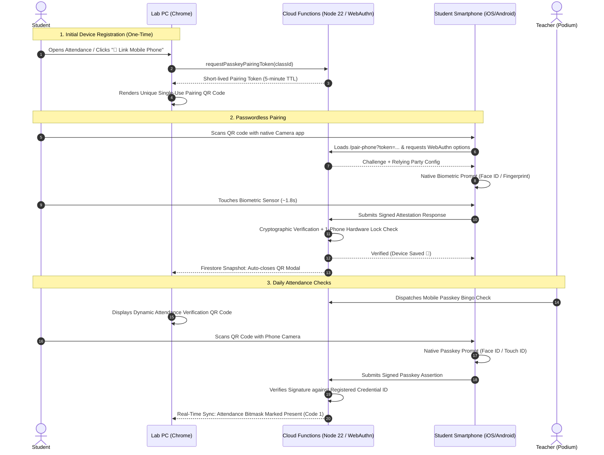
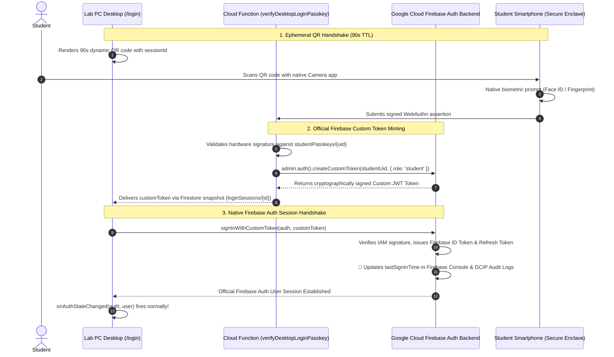
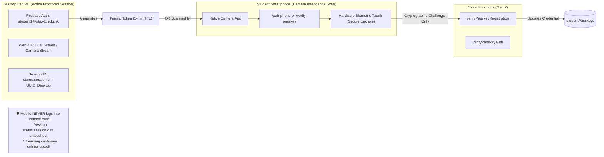

# 📱 Mobile Passkey Device Registration & Attendance Guide

[🏠 Documentation Index](../README.md#documentation-index) | [🧑‍🎓 Student User Manual](./user-manual-student.md) | [👨‍🏫 Teacher User Manual](./user-manual-teacher.md) | [🏛️ System Architecture](./system-architecture.md)

---

## 🎯 Executive Overview

In academic computer labs without webcams or hardware biometric readers on desktop PCs, students often share login credentials or remotely log into each other's accounts. 

To eliminate proxy attendance without requiring expensive lab hardware upgrades or invasive software installs, the **Google AI Classroom Platform** incorporates **Mobile Passkey Biometric Verification (FIDO2 / WebAuthn)**.

### Key Architectural Guarantees:
- **Zero Passwords on Mobile**: Students never type emails or passwords on their smartphones. Pairing is authorized via an encrypted, single-use token on their already-authenticated lab PC.
- **1-Phone = 1-Student Hardware Lock**: The platform authenticator's public credential ID is bound directly to the student's UID. The server cryptographically rejects attempts to register the same physical smartphone to multiple student accounts.
- **Fast Attendance (< 2 Seconds)**: Routine in-class attendance requires only pointing the phone camera at the PC screen and touching the biometric sensor (Face ID, Touch ID, or Android Fingerprint).
- **Teacher-Assisted Failsafes**: Built-in 1-click in-person verification for dead/broken phones and instant passkey resets for student phone replacements with full immutable audit logging.

---

## 🔄 End-to-End Visual Sequence



---

## 🧑‍🎓 Student Walkthrough: Registration, QR Login & Attendance

### Step 1: Enforced First-Time Registration Gate (Mandatory Lab Onboarding)

When a student logs in to a computer lab desktop for the first time without having linked a smartphone:

1. **Mandatory Desktop Gate (`PasskeyEnforcementGate`)**:
   - The desktop workspace immediately locks navigation to `/student`, `/student/records`, and screen/webcam streaming.
   - The desktop displays an anti-desktop security advisory:
     > ⚠️ **Shared Lab PC Detected — Desktop Passkeys Prohibited**  
     > *To guarantee your identity and prevent account duplication, passkeys must reside exclusively in your personal smartphone's hardware Secure Enclave (Apple Face ID or Android Fingerprint). Do NOT register Windows Hello or local PINs on this shared PC.*
   - A single-use 256x256 pairing QR code is generated (`/pair-phone?token=<tokenId>`).

2. **On your Smartphone:**
   - Open your smartphone's built-in **Camera app** (iOS Safari or Android Chrome).
   - Point your camera at the QR code on your PC monitor and tap the link notification.
   - Tap **`[ 📱 Pair This Phone ]`** and confirm with **Face ID** or **Fingerprint**.

3. **1-Phone = 1-Student Hardware Binding**:
   - The server extracts the public `credentialID` and verifies it is not bound to another student account (`DUPLICATE_DEVICE_COLLISION` check).
   - Once stored in `studentPasskeys/{uid}`, the desktop monitor detects the registration via Firestore snapshot and automatically dismisses the gate: *"🎉 Phone Paired! Entering classroom..."*

---

### Step 2: Desktop Login via Mobile Scan QR Code (Passwordless Cross-Device Auth)

For daily lab sessions, students can sign into shared desktop PCs without typing passwords on public keyboards:

1. **Select QR Login on Desktop**:
   - On the desktop login screen (`/login`), click **`📱 Scan QR Code`**.
   - An ephemeral 90-second dynamic QR code is displayed with live countdown.
2. **Scan with Phone Camera**:
   - Point your phone camera at the desktop monitor.
   - Tap the banner to open `/mobile-login?session=<sessionId>`.
3. **Biometric Authorization**:
   - Tap **`[ 📱 Sign In with Biometrics ]`** (or let auto-prompt trigger Face ID / Fingerprint).
   - Cloud Function `verifyDesktopLoginPasskey` validates the assertion and mints a Firebase Custom Auth Token for the desktop session.
4. **Desktop Auto-Login**:
   - The desktop PC detects `status: 'authorized'` in Firestore, calls `signInWithCustomToken(auth, customToken)`, and logs into the workspace without any keyboard entry.

---

### 🔄 Architectural Deep Dive: Native Firebase Auth Integration via Custom Tokens

A common architectural question is: **"In the past, Firebase Auth was built-in (email/password). Since the QR code flow is our own custom UI, how does it match Firebase Auth logs, sessions, and security rules?"**

The answer is that the QR code flow does **not** bypass or replace Firebase Auth. Instead, it utilizes Google's official **Firebase Auth Custom Token Minting** mechanism (`createCustomToken` on the backend and `signInWithCustomToken` on the client SDK).

#### End-to-End Authentication Bridge:



#### Dual-Mode Comparison: Built-In Email/Password vs. QR Code Passkey Flow

| Capability / Metric | Built-in Email/Password (Past) | QR Code Passkey Flow (New) |
| :--- | :--- | :--- |
| **Client Sign-In API** | `signInWithEmailAndPassword(auth, email, pass)` | `signInWithCustomToken(auth, customToken)` *(Standard Firebase SDK)* |
| **Firebase Auth Console** | Updates user's `lastSignInTime` | Automatically updates user's `lastSignInTime` identically |
| **`onAuthStateChanged()`** | Triggers reactive UI state | Triggers reactive UI state identically on desktop |
| **Firestore Security Rules** | Verified via `request.auth.uid` | Verified via `request.auth.uid` identically |
| **Custom Claims (`role`)** | Injected in JWT token | Injected directly via `createCustomToken(uid, { role: 'student' })` |
| **GCIP / Cloud Audit Logs** | Records `signInWithPassword` | Records `createCustomToken` and `signInWithCustomToken` events |
| **Dedicated Security Audit** | None | **`passkeyAuditLogs`** logs smartphone model, session ID, counter, and timestamp |
| **Shared Lab PC Keystrokes** | ❌ Vulnerable to hardware/software keyloggers & shoulder surfing | ✅ **Zero keystrokes on lab PC keyboard** |

#### Complete Student Device Lifecycle:

1. **Desktop Lab PC (Zero Passwords):**
   - Students **never** need to type their email or password on shared lab PC keyboards.
   - The desktop displays an ephemeral QR code that unlocks via phone biometric scan.
2. **First-Time Setup on Mobile Phone:**
   - The student logs in on their personal smartphone using their institutional **Email & Password**.
   - After signing in, they tap **`[ 📱 Enable Mobile Passkey ]`**.
   - Their phone's hardware security chip (Apple Secure Enclave / Android Keystore) generates a FIDO2 key pair linked to their UID.
3. **Subsequent Mobile Logins:**
   - Future logins on the smartphone use the biometric passkey (instant Face ID or Fingerprint), eliminating password entry on mobile as well.
4. **Enforcement Behavior If Passkey Is NOT Enabled:**
   - **On Mobile:** The student **can still log in with Email & Password** on their personal smartphone. This ensures they are never locked out of their personal device and can proceed to enable their passkey.
   - **On Desktop:** Desktop access is **strictly blocked**:
     - Scanning the desktop QR code halts with: *"No passkey registered on this device yet."*
     - Typing email/password on desktop triggers [`PasskeyEnforcementGate`](file:///home/developer/Documents/Gemini-AI-Classroom-Assistant/web-app/src/components/passkey/PasskeyEnforcementGate.jsx), locking navigation, streaming, and attendance.
     - The only desktop bypasses are:
       1. **Teacher Manual Failsafe** (Podium 1-click or Emergency PIN).
       2. **Global Password Whitelist (`system_config/loginPolicy`)**: Admins and test accounts placed in the `passwordWhitelist` array are permitted to sign in on Desktop with their institutional email/password without passkey barrier blocking.

---

### Step 3: Daily Lab Attendance Verification (< 2 Seconds)

Once your phone is paired, taking attendance during lectures or labs is fast and effortless:

1. **Teacher Launches Attendance Check:**
   - A dynamic attendance QR code appears on your Lab PC monitor.
2. **Scan with Phone:**
   - Point your phone camera at the PC screen.
3. **Biometric Confirmation:**
   - Your phone immediately triggers Face ID / Fingerprint prompt.
4. **Attendance Recorded:**
   - Mobile displays: **"✅ Attendance Verified!"**
   - Lab PC display updates to **"📱 Passkey Verified!"** with a green checkmark.

---

## 👨‍🏫 Teacher Administration & Edge-Case Management

In computer lab environments, edge cases such as dead phone batteries, forgotten phones, cracked camera lenses, or device replacements will occur. The platform provides a multi-tier teacher failsafe architecture:

### 1. Remote 1-Click Approval on Teacher Podium HUD (`MonitorView`)

When a student arrives at a lab PC without a usable smartphone:

```
  Desktop Lab PC (Student)                    Teacher Podium HUD (MonitorView)
┌────────────────────────────┐              ┌─────────────────────────────────────────────────────────┐
│ Passkey Enforcement Gate   │              │ ⚠️ Passkey Remote Bypass Requests (1 Pending)           │
│ [🙋 Request Teacher Bypass]│──Firestore──►│ • Chan Tai Man (student1@stu.vtc.edu.hk)                │
│ "Phone battery dead"       │              │   Reason: Phone battery depleted (14:02)                │
│                            │              │   [ ✅ Grant 1-Class Session Bypass ]   [ ❌ Deny ]     │
└────────────────────────────┘              └─────────────────────────────────────────────────────────┘
              ▲                                                           │
              │                                                Cloud Function onCall
              │                                            handleApproveTeacherPasskeyBypass
              │                                                           │
              └────────────── Firestore Real-Time Unlock ─────────────────┘
                         (studentProperties/{uid}.passkeyBypass)
```

1. **Student Request**: The student clicks **`🙋 Request Teacher Remote Bypass`** on the desktop gate, selects a reason (e.g., "Phone battery dead" or "Left phone at home"), and submits.
2. **Instant Podium Notification**: A high-visibility alert banner appears in real time on the teacher's `MonitorView` HUD showing the student's name, email, and timestamp.
3. **1-Click Authorization**: The teacher glances across the lab to verify the student's identity and clicks **`[ ✅ Grant 1-Class Session Bypass ]`**.
4. **Cloud Execution**: `handleApproveTeacherPasskeyBypass` grants a 180-minute bypass window in `studentProperties/{studentUid}.passkeyBypass` and writes an immutable audit entry to `passkeyAuditLogs`.
5. **Zero-Latency Gate Unlock**: The desktop PC detects the bypass flag via Firestore listener and transitions straight into the classroom workspace without requiring any page reload.

---

### 2. In-Person 6-Digit Class Emergency PIN Bypass

If the teacher's podium browser is temporarily busy or network connectivity between the podium and the student is delayed:

1. **Emergency PIN Display**: The teacher HUD displays a generated 6-digit emergency PIN for the class session (e.g., `🔑 Emergency Bypass PIN: 849201`).
2. **Student Entry**: On the desktop gate modal, the student selects **`🔑 Enter Emergency Teacher PIN`** and inputs the 6-digit PIN.
3. **Server Verification**: Cloud Function `handleVerifyTeacherPasskeyBypassPin` validates the PIN against `classes/{classId}.teacherBypassPin`.
4. **Temporary Access**: Upon validation, a 180-minute bypass is provisioned, the gate unlocks immediately, and an audit log records the PIN bypass event.

---

### 3. In-Person Attendance Bingo Override (Live Attendance Failsafe)

During interactive Mobile Passkey Bingo Attendance:

1. **Student Action:** If a student cannot scan the attendance QR, they click **`🙋 I don't have my phone today`** on their Lab PC screen.
2. **Podium Alert:** The teacher's live monitor instantly surfaces an alert banner showing the student's name, seat, and timestamp.
3. **Verification:** The student approaches the teacher's podium. The teacher confirms physical presence and clicks **`[ ✅ Verify In-Person ]`**.
4. **Result:** The student's attendance bitmask is marked present with verification type `in_person_teacher_override`.

---

### 4. Replacing or Upgrading a Smartphone (Passkey Reset)

Because each student account is locked 1-to-1 to a physical device hardware authenticator, a student who buys a new phone or gets a replacement cannot simply pair a second phone without resetting the previous registration.

#### Method A: Reset from Live Attendance / Podium View
1. When the student approaches the podium, the teacher locates the student in the **Active Attendance Table**.
2. Click the **`[ 🔄 Reset Passkey ]`** button in the *Podium Actions* column.
3. Confirm the modal: *"Reset passkey registration for student1@stu.vtc.edu.hk? This will unlink their existing smartphone."*
4. The previous credential ID is unlinked, and an entry is written to `passkeyAuditLogs`.
5. The student can immediately scan the pairing QR code with their new phone.

#### Method B: Reset from Class Management Roster
1. Navigate to **`👥 Class Management`** ➔ Select the class.
2. Under the **Enrolled Students Roster**, locate the student.
3. In the **Phone Passkey** column:
   - If paired: Displays `📱 Apple iPhone` (or Android model) with a **`[ 🔄 Reset ]`** button.
   - If unlinked: Displays `⚪ Not Paired`.
4. Click **`[ 🔄 Reset ]`** and confirm.

---

## 💻 Desktop Registration & Verification Block Policy

A core architectural principle of the Mobile Passkey subsystem is that **shared desktop computers must never be registered as passkey hardware authenticators**.

### Why Desktop Registration is Blocked:
1. **Shared Public Hardware**: Lab PCs are used by hundreds of students across multiple classes. Registering a lab PC's browser or TPM would anchor attendance to the shared classroom desk rather than the student's personal physical possession.
2. **Deep Freeze & Nightly Re-imaging Disruption**: Most institutional computer labs run disk-protection software (e.g., Faronics Deep Freeze) that wipes local user profiles and credentials upon reboot. Any desktop-stored WebAuthn credentials would vanish nightly, causing repeated authentication lockouts.
3. **Absence of Dedicated Personal Biometrics**: Desktop computers in university and school labs rarely feature individual Touch ID or Windows Hello face recognition for each student profile.
4. **Hardware Anti-Proxy Guarantee**: Enforcing mobile-only registration ensures the cryptographic credential ID is generated inside the student's personal smartphone hardware security module (Apple Secure Enclave or Android Titan M2).

### UI Enforcement:
- **Direct Desktop Route Access**: If a student opens `/pair-phone`, `/verify-passkey`, or `/mobile-login` on a desktop browser (Windows, macOS Chrome, or Linux), `isMobileDevice()` detects the desktop environment and immediately renders the **`🚫 Mobile Phone Required`** barrier:
  > *"Passkey device registration is restricted to personal mobile phones. Shared desktop computers in the lab cannot be registered as mobile passkeys. Please scan the QR code displayed on your PC screen using your phone camera."*
- **Desktop Modal (`PasskeyPairModal.jsx`) & Gate (`PasskeyEnforcementGate.jsx`)**: When viewed on a desktop monitor, the dialog strictly renders the **QR Code** and instructions to open the native smartphone camera. Direct registration links are suppressed on desktop viewports.

---

## 🔒 Single-Session Integrity vs. Passwordless Mobile Passkey (No Dual Session Needed)

A common question when designing companion mobile flows is whether the system must support "Dual Sessions" (1 mobile session + 1 desktop session) and whether opening the phone will displace the student's active desktop stream.

### Architectural Guarantee: Zero Session Interference


### Why Dual Session Support is Unnecessary & Intentionally Avoided:
1. **Passwordless & Sessionless on Mobile**:
   - The mobile pairing and attendance pages **do not create an interactive Firebase Auth user session**.
   - Pairing is authorized solely through the short-lived, encrypted `pairingToken` issued by the student's already-authenticated Lab PC.
   - Attendance verification is authorized via the signed WebAuthn challenge payload.
   - Consequently, the student's mobile phone does not write to `classes/{classId}/students/{studentUid}/status.sessionId`.
2. **Preserving Strict Account Anti-Sharing (Single-Session Displacement)**:
   - The platform's single-session lock (`status.sessionId`) remains **100% active and uncompromised on desktop**.
   - If Student A gives their institutional password to Student B to log in on a second lab PC or from home, the second desktop login instantly displaces the first with the warning:
     > ⚠️ **Classroom session active in another tab or device.**  
     > *Streaming in this tab is paused to prevent dual-streaming conflicts.*
3. **Zero FinOps Overhead**:
   - Because mobile passkeys operate completely sessionless via lightweight Cloud Functions callables, there are no idle Firestore listener connections or duplicated WebRTC peer connections on mobile.

---

## 🛡️ Anti-Cheating & Security Analysis

| Threat / Cheating Vector | Vulnerability in Standard Systems | Platform Passkey Defense |
| :--- | :--- | :--- |
| **Password Sharing & Keyloggers on Lab PCs** | Students type passwords on public lab keyboards vulnerable to hardware/software keyloggers or shoulder surfing. | **Blocked**: Desktop QR Login (`/mobile-login`) allows complete passwordless authentication. Students authenticate solely on their personal mobile biometric sensor, minting an ephemeral custom token directly to the desktop session. |
| **Lab PC Passkey Pollution & Re-imaging Wipes** | Passkeys stored on Windows Hello / macOS Keychain pollute shared PCs and are wiped by nightly Deep Freeze re-imaging. | **Blocked**: Desktop WebAuthn is strictly barred (`isMobileDevice()`). Authenticators reside exclusively in the student's mobile hardware security module (Secure Enclave / Android Keystore). |
| **Multiple PC Logins (Proxy Sitting)** | One student logs into multiple PCs in the lab. | **Blocked**: Desktop single-session displacement (`sessionId`) immediately boots older tabs when a new login occurs. |
| **Device Sharing (1 Phone for 2 Students)** | One present student brings their phone and attempts to register or proxy-login for absent friends. | **Blocked via Strict 1:1:1 Binding**: Each mobile browser stores a persistent `deviceFingerprint` (`mdev_<uuid>`). The server validates `where('deviceFingerprint', '==', deviceFingerprint)`. If the phone is already bound to Student A, Student B's registration or login attempt is immediately aborted with `Hardware Lock Violation`. |
| **Attempting to Register Lab PC as Passkey** | Student tries to register the shared PC browser to automate passkey prompts. | **Blocked**: `isMobileDevice()` detects desktop environments on `/pair-phone` and halts execution with `status: 'desktop_blocked'`. |
| **QR Code Forwarding / Screenshots** | Absent student asks present friend to take a photo of the QR code and message it. | **Blocked**: QR codes encode single-use nonces and 90s/300s TTLs. Biometric assertion requires the physical device containing the student's private key. |
| **Teacher Bypass Abuse / Privilege Creep** | Unrestricted permanent bypasses granted for absent students. | **Blocked**: All teacher bypasses automatically expire after 180 minutes (current class duration). Every bypass decision (remote 1-click or PIN) writes an immutable record to `passkeyAuditLogs`. |
| **Simulated WebAuthn Extensions** | Malicious desktop browser extensions spoofing passkeys. | **Blocked**: Registration mandates `authenticatorAttachment: 'platform'` and hardware-backed user verification (`userVerification: 'required'`). |

---

## 🗄️ Firestore Data Schema Reference

### `studentPasskeys/{uid}`
```json
{
  "uid": "student_uid_123",
  "studentEmail": "student1@stu.vtc.edu.hk",
  "credentialID": "base64url_encoded_public_id",
  "credentialPublicKey": "base64url_encoded_public_key",
  "deviceFingerprint": "mdev_9b1deb4d-3b7d-4bad-9bdd-2b0d7b3dcb6d",
  "counter": 14,
  "deviceModel": "Apple iPhone",
  "createdAt": "2026-09-26T06:00:00.000Z",
  "lastUsedAt": "2026-09-26T06:15:00.000Z"
}
```

### `loginSessions/{sessionId}`
Dynamic 90-second session for Desktop Login via Mobile Scan QR Code:
```json
{
  "sessionId": "uuid_v4_session_string",
  "status": "pending | authorized | expired",
  "customToken": "firebase_minted_custom_auth_token_jwt",
  "studentUid": "student_uid_123",
  "studentEmail": "student1@stu.vtc.edu.hk",
  "createdAt": "2026-09-27T08:00:00.000Z",
  "expiresAt": "2026-09-27T08:01:30.000Z"
}
```

### `classes/{classId}/passkeyBypassRequests/{studentUid}`
Pending remote bypass claims displayed on teacher podium:
```json
{
  "studentUid": "student_uid_123",
  "studentEmail": "student1@stu.vtc.edu.hk",
  "studentName": "Chan Tai Man",
  "reason": "phone_battery_dead | left_phone_at_home | camera_damaged | other",
  "status": "pending | approved | denied",
  "requestedAt": "2026-09-27T08:05:00.000Z",
  "reviewedAt": "2026-09-27T08:05:30.000Z",
  "reviewedBy": "teacher1@vtc.edu.hk"
}
```

### `studentProperties/{studentUid}.passkeyBypass`
Active lesson-level bypass status granted by teacher remote 1-click or emergency PIN:
```json
{
  "passkeyBypass": {
    "active": true,
    "classId": "IT114115-Demo",
    "grantedBy": "teacher1@vtc.edu.hk | pin_verified",
    "grantedAt": "2026-09-27T08:05:30.000Z",
    "expiresAt": "2026-09-27T11:05:30.000Z",
    "method": "remote_approval | pin"
  }
}
```

### `passkeyAuditLogs/{logId}`
```json
{
  "studentUid": "student_uid_123",
  "studentEmail": "student1@stu.vtc.edu.hk",
  "action": "passkey_registered | passkey_authenticated | passkey_login | passkey_reset | teacher_bypass_remote | teacher_bypass_pin",
  "performedBy": "teacher1@vtc.edu.hk | student_uid_123",
  "reason": "phone_replacement | phone_dead | emergency_pin",
  "timestamp": "2026-09-27T08:05:30.000Z"
}
```
