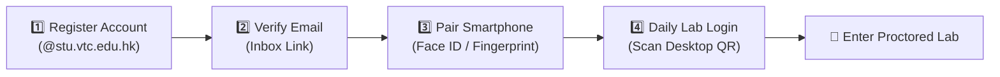
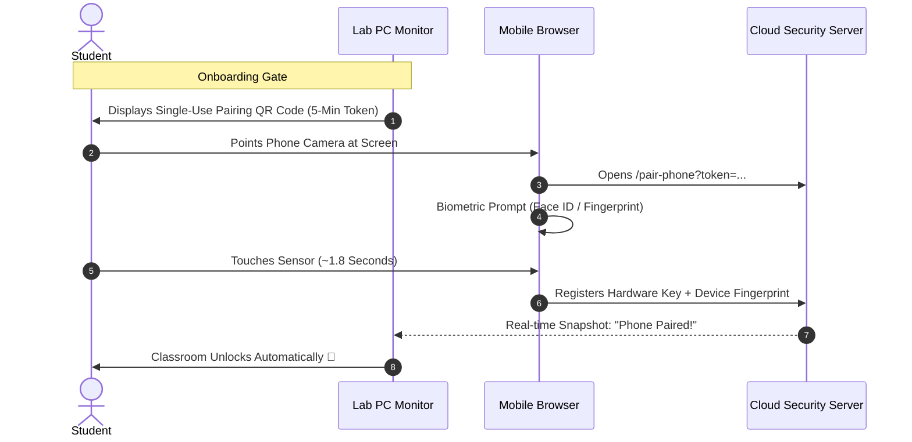

# 🧑‍🎓 Student Registration & Passkey Onboarding Guide

[🏠 Documentation Index](../README.md#documentation-index) | [🧑‍🎓 Student User Manual](./user-manual-student.md) | [📱 Mobile Passkey Architecture](./passkey-device-registration-guide.md) | [👨‍🏫 Teacher Manual](./user-manual-teacher.md)

---

## 🎯 Welcome to Google AI Classroom

The **Google AI Classroom** platform provides an AI-assisted learning and lab invigilation environment. 

To protect your identity, prevent credential theft on shared lab computers, and enable **instant 2-second in-class attendance**, the system pairs your student account with your personal smartphone using **Biometric Passkeys (FIDO2 / WebAuthn)**.



---

## 📱 Browser & Platform Matrix

Before getting started, make sure you are using a supported browser for your device:

| Device | Permitted Browsers | Blocked Browsers | Why |
| :--- | :--- | :--- | :--- |
| **Lab Desktop PC** | **Google Chrome** (v120+) | Firefox, Edge, Safari | Required for WebRTC screen capture, on-device LiteRT AI speech recognition, and proctoring. |
| **Apple iPhone (iOS 16+)** | **Apple Safari** or **Google Chrome for iOS** (`CriOS`) | Firefox on iOS, Edge on iOS, Opera, In-app WebViews | iOS mandates WebKit and Apple Credential Management (`ASAuthorizationController`). Passkeys sync across Safari and Chrome on iOS via iCloud Keychain. |
| **Android Phone** | **Google Chrome for Android** | Samsung Internet, Firefox, Edge, Opera, UC Browser | Required for Google Credential Manager & Fingerprint biometric sheet. Non-Chrome browsers isolate credentials and do not sync with Google Password Manager. |

> [!TIP]
> **Android Users Opening Samsung Internet:** If your phone camera opens Samsung Internet, tap the **`🚀 Open in Google Chrome`** button on screen to transfer the pairing link into Google Chrome with 1 tap.
>
> **iPhone Users with Microsoft Authenticator:** If you use Microsoft Authenticator, ensure **iCloud Passwords & Keychain** remains enabled in iPhone **Settings ➔ Passwords ➔ Password Options**. Microsoft Authenticator on iOS only supports Microsoft accounts; third-party passkeys require Apple Keychain.

---

## 1️⃣ Step 1: Create Your Account (First-Time Registration)

If you do not have an account yet:

1. On a lab PC (or personal laptop), open **Google Chrome** and navigate to the portal login page:
   ```text
   https://it114115-2627.web.app/login
   ```
2. Click the **"✉️ Email & Password"** tab (or switch tab below the QR code).
3. Fill in the fields:
   * **Email Address:** Your institutional student email ending with `@stu.vtc.edu.hk` (e.g. `250123456@stu.vtc.edu.hk`).
   * **Password:** Enter a strong password (minimum 8 characters).
4. Click the **`[ Register ]`** button.
5. **Verify Your Email:**
   * A verification email will be dispatched to your VTC Outlook inbox (`webmail.vtc.edu.hk`).
   * Open the email from *Google AI Classroom* and click the verification link.
   * Return to the login page and sign in with your email and password.

---

## 2️⃣ Step 2: Pair Your Smartphone (One-Time Setup)

Once you sign in on a lab computer for the first time, the platform presents the **Personal Mobile Passkey Required** onboarding gate (`PasskeyEnforcementGate`).



### Instructions for Apple iPhone (iOS)

#### Pre-Flight Checklist on iPhone:
1. **iCloud Keychain ON:** Open iPhone **Settings** $\rightarrow$ Tap your **[Name / Apple ID]** at the top $\rightarrow$ **iCloud** $\rightarrow$ **Passwords & Keychain** $\rightarrow$ Ensure **"Sync this iPhone"** is turned **ON**.
2. **Face ID / Passcode:** Ensure your iPhone has a passcode and Face ID / Touch ID registered.
3. **Private Browsing OFF:** Open Safari and ensure you are in a standard tab, not a Private tab.

#### Pairing Steps:
1. Open the built-in **iOS Camera app** on your iPhone.
2. Point your camera at the **Pairing QR Code** on your lab PC monitor.
3. Tap the yellow **Safari pop-up link** that appears in the camera preview.
4. On the webpage, tap **`[ 🔐 Pair This Phone ]`**.
5. The iOS system prompt will display: *"Do you want to save a passkey?"*
6. Glance at **Face ID** (or touch **Touch ID**).
7. The page will show: **"🎉 Phone Paired! Active & Ready"**. Your lab desktop PC will automatically unlock!

---

### Instructions for Android Phones

#### Pre-Flight Checklist on Android:
1. **Screen Lock Configured:** Open Android **Settings** $\rightarrow$ **Security** (or Lock Screen) $\rightarrow$ Ensure you have a **PIN / Pattern** and **Fingerprint** registered.
2. **Google Play Services Active:** Ensure your phone is signed into a Google account with Google Play Services updated.
3. **Use Google Chrome:** Ensure Google Chrome is installed and set as default browser.

#### Pairing Steps:
1. Open **Google Chrome** on your Android phone (or use the native Camera app / Google Lens).
2. Scan the **Pairing QR Code** on your lab PC monitor.
3. Ensure the URL opens inside **Google Chrome**.
4. Tap **`[ 🔐 Pair This Phone ]`**.
5. The **Google Credential Manager** bottom sheet will slide up from the bottom of your screen: *"Create a passkey"*.
6. Touch your phone's **Fingerprint sensor** (or enter device PIN).
7. The page confirms **"🎉 Phone Paired!"** and your lab desktop PC unlocks!

---

## 3️⃣ Step 3: Daily Lab Sign-In (Scan QR Code)

Once your phone is paired, you **never need to type your password** on public lab keyboards:

1. Sit down at any lab desktop PC displaying the login screen:
   * The screen displays the dynamic **📱 Scan QR Code (Lab PC)** with a 15-second rotating countdown bar.
2. Open your phone's **Camera app** (iOS Camera or Android Camera/Chrome).
3. Point your camera at the desktop QR code.
4. Tap the link banner.
5. Your phone will prompt:
   * **iPhone:** Face ID automatically verifies.
   * **Android:** Touch your Fingerprint sensor.
6. The lab PC detects the authorization and **signs in automatically in under 2 seconds!**

---

## 4️⃣ In-Class Attendance & Lecture Bingo

During lectures and lab exercises, your instructor will periodically trigger active presence checks (**Lecture Bingo**):

1. An attendance challenge QR code appears on the classroom projector or your desktop screen.
2. Point your phone camera at the code.
3. Confirm with **Face ID / Fingerprint**.
4. Your attendance and active participation points are logged immediately into the class roster.

---

## 5️⃣ Troubleshooting & FAQ

### Q1: I get an error: *"Device Mismatch: This passkey was registered on a different physical smartphone."*
* **Root Cause:** The browser you used when **pairing** is different from the browser you used when **scanning** the desktop QR code.
  * *Example:* You paired inside Chrome for iOS, but your iPhone camera opened the login QR in Safari. Because iOS isolates storage between apps, the server detected two different browser fingerprints.
* **Solution:**
  1. Notify your instructor to click **`[ 🔄 Reset ]`** next to your name on the Class Management Roster.
  2. On your iPhone, open **Safari** (make sure Private Browsing is **OFF**).
  3. Scan the pairing QR code using the **built-in iOS Camera app** and complete pairing in **Safari**.
  4. Always use the built-in Camera app to scan for login.

---

### Q2: My phone does not trigger Face ID or Fingerprint (nothing pops up)
* **On iPhone:**
  * Open **Settings** $\rightarrow$ **[Your Name]** $\rightarrow$ **iCloud** $\rightarrow$ **Passwords & Keychain** $\rightarrow$ Turn **ON** *"Sync this iPhone"*.
  * Make sure Safari is **not in Private Browsing mode**.
  * Make sure you are not inside WeChat, Teams, or an in-app browser.
* **On Android:**
  * Open **Settings** $\rightarrow$ **Security** $\rightarrow$ **Screen Lock** $\rightarrow$ Make sure you have a secure PIN and Fingerprint enabled. Passkeys will refuse to pop up if screen lock is set to "None" or "Swipe".
  * Ensure the page is opened in **Google Chrome for Android**.

---

### Q3: My phone is dead, left at home, or undergoing repair today
You do not need a permanent exemption. Use the **Teacher Temporary Bypass**:
1. On the lab PC passkey gate screen, click:
   > **`🙋 Phone Unavailable? (Dead Battery / Left at Home)`**
2. Select your desk number and the reason (e.g. *Battery Depleted*).
3. Click **Send Request to Teacher Podium**.
4. Notify your instructor. Your instructor will click **Approve** from their podium dashboard.
5. Your PC unlocks for the duration of the current lesson!

---

### Q4: Can I share a phone with my classmate?
* **No.** The platform enforces a strict **1-Phone = 1-Student Hardware Lock**.
* Each physical phone's Secure Enclave can only be bound to one student account. Attempting to pair a phone already bound to another student will be rejected by the server:
  > *`Hardware Lock: This physical phone is already bound to another student account.`*

---

### Q5: I bought a new phone or replaced my device. How do I switch?
1. In your next lab class, tell your teacher that you replaced your phone.
2. Your teacher opens **Class Management** $\rightarrow$ **Enrolled Roster Details** and clicks **`[ 🔄 Reset ]`** next to your name.
3. This revokes your old phone's hardware credential.
4. Scan the Pairing QR code on your PC monitor with your new phone to link it.

---

### Q6: I have an Honor phone running MagicOS 8.0 and passkey fails with "provider not found"
* **Root Cause:** Honor MagicOS 8.0 disables Google Play Services by default on several regional models, and sets the system autofill to Honor's built-in vault.
* **Solution:**
  1. Open **Settings (设置)** ➔ **Users & accounts (用户与账户)** ➔ toggle **Google Play Services (Google Play 服务)** to **ON**.
  2. Open **Settings** ➔ **System & updates (系统和更新)** ➔ **Language & input (语言和输入法)** ➔ **Autofill service (自动填充服务)** ➔ select **Google (Google 密码管理器)**.
  3. Ensure a **Screen Lock PIN** and **Fingerprint** are set in **Settings** ➔ **Biometrics & password**.
  4. Open the link in **Google Chrome**.

---

### Q7: What happens if I scan an attendance QR code on a new or unpaired phone?
* **Zero Friction In-Situ Setup:** You do NOT need to panic or find a computer!
* When you scan an attendance QR code (routine lab PC attendance or lecture hall screen QR) or desktop login QR code on a phone without a pre-registered passkey:
  1. The page detects that no passkey exists on this phone and displays the **In-Situ Password Fallback Card** (`Set Up Attendance Passkey`).
  2. If your student email is associated with the challenge, it is pre-filled automatically.
  3. Simply enter your classroom account password and tap **`[ 🔑 Log In & Register Passkey ]`**.
  4. Your phone prompts you to save a biometric passkey (Face ID, Fingerprint, or Screen Lock). Confirm on your phone.
  5. The platform binds your phone's hardware credential to your account (enforcing the 1-Phone = 1-Student hardware lock) and **instantly completes your attendance verification** without requiring you to re-scan!
  6. For all future classes, you can simply tap the biometric sensor in under 2 seconds!

---

## 🔒 Security Best Practices Summary

* **Lab Desktop:** Always use **Google Chrome**.
* **iPhone Students:** Use **Apple Safari** or **Google Chrome for iOS** (ensure iCloud Keychain is ON).
* **Android Students:** Always use **Google Chrome for Android** with a secure Screen Lock.
* Never share your password or phone with anyone else.
* If your phone is unavailable, use **Teacher Temporary Bypass** rather than trying to register public PC credentials.
